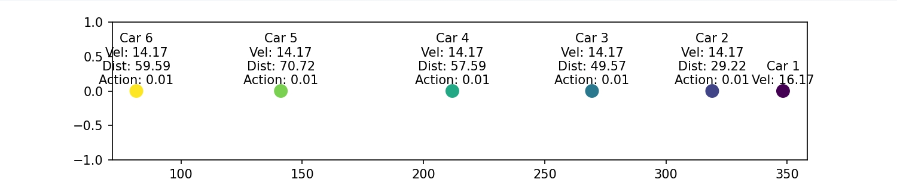

# RLFleetControl

Fleet control uses reinforcement learning.

## 环境配置
### Conda 环境导出
为了让他人能够复现相同的开发环境，使用以下命令将当前 Conda 环境导出为 `environment.yml` 文件：
```bash
conda env export | grep -v "^prefix" > environment.yml
```
### Conda 环境复制
```bash
conda env create -f environment.yml
```
### 安装RL复现和绘图 车队仿真环境
    pip install -e .
    
## 目录结构

## 训练环境说明

car1: 领航车
car2~n: 跟随车

### 车辆状态
车辆状态使用简单的线性空间方程实现，同时为输出矩阵 $C$ 添加了阻尼

$$x_{prime} = A \cdot x + B \cdot u \cdot dt$$

$$y = C \cdot x + D \cdot u$$


### 训练结果绘图
结果保存在